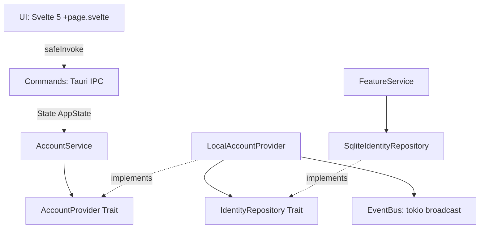
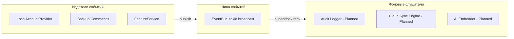
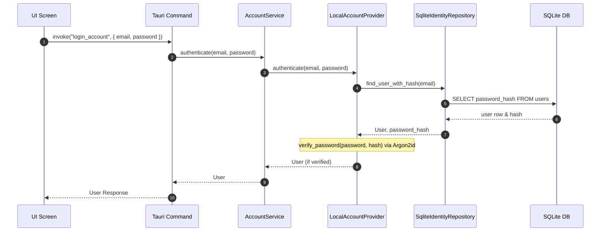
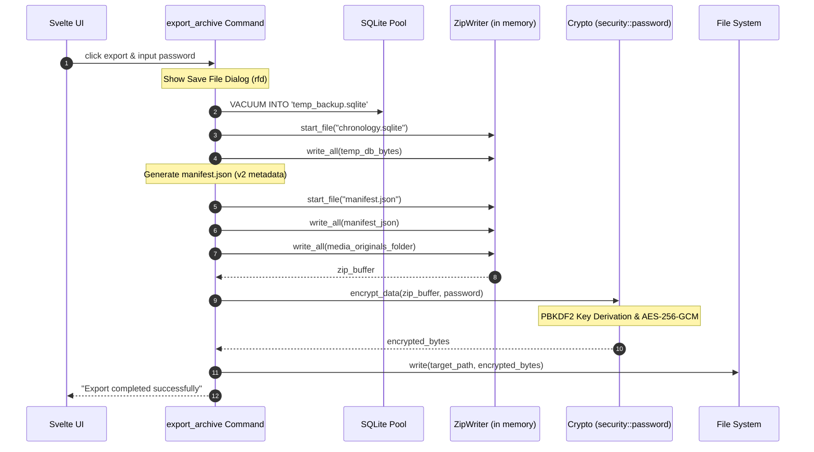

# Карта зависимостей и процессов

Данный документ содержит визуальные диаграммы архитектурных связей, потоков событий и сценариев выполнения ключевых процессов в приложении ХРОНИКИ.

---

## 1. Карта зависимостей компонентов (Dependency Graph)

Компоненты ядра связаны с соблюдением инверсии зависимостей. Бизнес-логика зависит от абстрактных интерфейсов (Traits), а хранилище реализует их:

---

## 2. Потоки событий (Event Flow Pipeline)

Асинхронные события домена (`DomainEvent`) публикуются в шину и рассылаются фоновым подписчикам:

---

## 3. Диаграмма последовательности: Авторизация (Auth Sequence)

Процесс аутентификации локального пользователя:

---

## 4. Диаграмма последовательности: Экспорт архива (Backup Export Sequence)

Процесс безопасного создания зашифрованной резервной копии v2:

